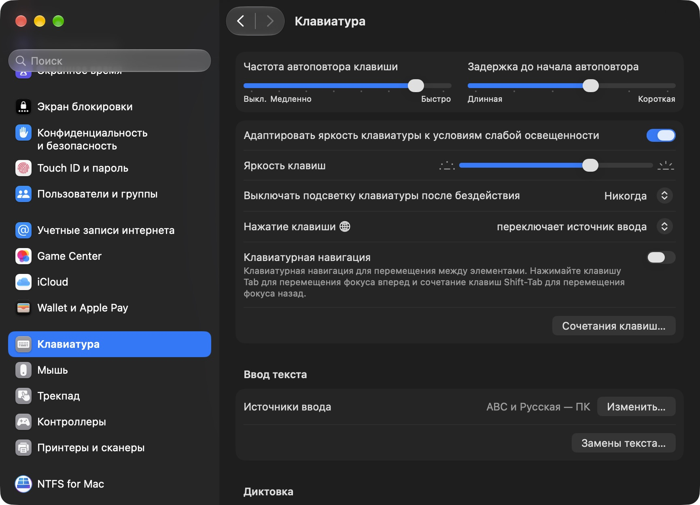
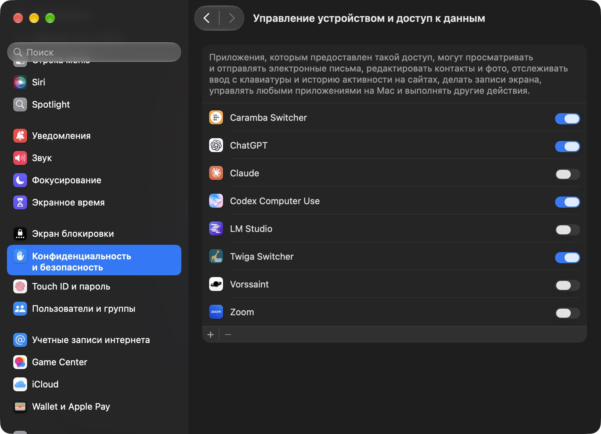
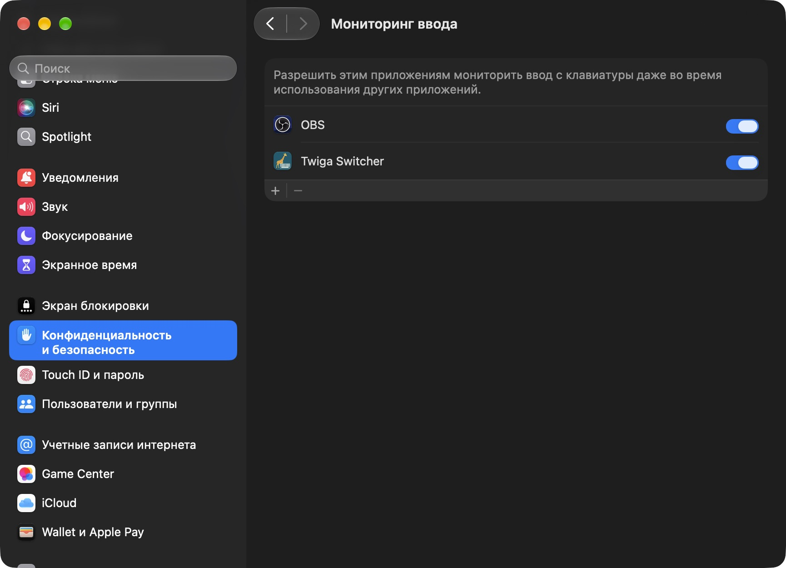

<p align="center">
  
</p>

# Twiga Switcher

**Twiga Switcher — бесплатное приложение для автоматического переключения русской и английской раскладок на macOS.**

Печатайте по-русски и по-английски, не отвлекаясь на переключение языка. Twiga Switcher исправляет слова, набранные в неверной раскладке, и переключает её для продолжения ввода. Приложение работает в строке меню вашего Mac и обрабатывает текст локально.

Например, `ghbdtn` превращается в **привет**, а `руддщ` — в **hello**.

[Скачать приложение](https://github.com/alwinn1977/twiga-switcher/releases) · [Установка](#установка) · [Первый запуск](#первый-запуск) · [Настройка](#настройка-приложения) · [Свой словарь](#как-создать-свой-словарь) · [Помощь](#если-что-то-не-работает)

## Что умеет приложение

- **Исправляет раскладку во время набора.** Для уверенно распознанных слов переключение начинается уже после первых букв: например, `ghbd` превращается в `прив`, а продолжение вы набираете в русской раскладке. Короткие и неоднозначные слова приложение проверяет после пробела или другого разделителя.
- **Работает в обоих направлениях.** Можно переходить с русского на английский и обратно в одном тексте.
- **Учитывает фразы и пунктуацию.** Распознаёт выражения из нескольких слов, сохраняет пробелы и знаки после исправленного слова, учитывает раскладку клавиш со знаками препинания.
- **Позволяет отменить ошибочную замену.** Отдельное сочетание возвращает исходное слово и временно запрещает повторное исправление этой пары.
- **Исправляет слово по вашей команде.** Если автоматическое распознавание пропустило слово, его можно преобразовать вручную — в том числе сразу после пробела.
- **Запоминает ваши решения.** После ручного исправления можно выбрать «Всегда» или «Никогда» для конкретной пары слов. Сохранённые правила доступны в отдельном окне.
- **Поддерживает дополнительные словари.** Базовые русский и английский словари дополнены компьютерными терминами. Можно подключать собственные словари.
- **Настраивается отдельно для разных приложений.** Например, оставить исправления в редакторе и выключить их в терминале или программе удалённого доступа.
- **Поддерживает автозапуск, русский и английский интерфейс, настраиваемые сочетания клавиш и звук переключения.**

Приложение рассчитано на ввод с клавиатуры в редактируемых полях. Это переключатель раскладки, а не переводчик или проверка орфографии; вставленный из буфера обмена текст автоматически не преобразуется.

## Установка

Нужна **macOS 14 или новее**, а также включённые русская и английская раскладки. Для готовой сборки инструменты разработки не требуются.

### Из готового DMG

1. Откройте [страницу релизов](https://github.com/alwinn1977/twiga-switcher/releases) и скачайте `.dmg` подходящей версии.
2. Выберите файл для своего Mac: **`arm64`** — для Apple Silicon (M1 и новее), **`x86_64`** — для Intel, если такая сборка есть в релизе. Тип процессора указан в ** → Об этом Mac**.
3. Откройте образ и перетащите **Twiga Switcher.app** на **Applications** — папку «Программы».
4. Дождитесь копирования, извлеките образ и запустите **Twiga Switcher** из **Программ**.

Если готового образа в релизе пока нет, воспользуйтесь сборкой из исходников ниже.

### Если macOS блокирует запуск

Готовая сборка пока не прошла проверку Apple, поэтому при первом открытии система может показать предупреждение.

1. Попробуйте открыть установленное приложение из «Программ» и закройте появившееся предупреждение, сохранив приложение.
2. Откройте ** → Системные настройки → Конфиденциальность и безопасность**.
3. Прокрутите вниз до блока **Безопасность**.
4. Рядом с сообщением о блокировке **Twiga Switcher** нажмите **Всё равно открыть** (`Open Anyway`). Кнопка появляется после заблокированной попытки запуска.
5. Подтвердите действие паролем или Touch ID, если потребуется, и нажмите **Открыть** в повторном диалоге.

Подробности — [в инструкции Apple](https://support.apple.com/ru-ru/102445). На рабочем Mac запуск может ограничиваться настройками вашей организации.

<details>
<summary><strong>Как собрать приложение из исходников</strong></summary>

Нужны инструменты разработки со **Swift 6 или новее**. Установите совместимый Xcode или Command Line Tools; для установки последних выполните в Терминале:

```sh
xcode-select --install
```

Затем получите исходники и соберите приложение:

```sh
git clone https://github.com/alwinn1977/twiga-switcher.git
cd twiga-switcher
scripts/build-app.sh --public
open build/public
```

Перетащите **Twiga Switcher.app** из открывшейся папки в **Программы** и запустите его оттуда. После запуска выполните настройку доступов ниже.

</details>

## Первый запуск

После запуска найдите **значок клавиатуры в строке меню**, в верхней части экрана. Нажмите его и выберите **Настроить доступы…** или **Настройки…**. Отдельного главного окна и значка в Dock у приложения нет.

Иллюстрации ниже сделаны в русскоязычной **macOS 27.0.1**. На вашем Mac внешний вид, список приложений и названия некоторых пунктов могут отличаться.

### 1. Проверьте русскую и английскую раскладки

1. Откройте **Системные настройки → Клавиатура**.
2. В разделе **Ввод текста → Источники ввода** нажмите **Изменить…**.
3. Если одного из языков нет, нажмите **+** и добавьте английскую и русскую раскладки.

Для английского подходят **US** или **ABC**, для русского — **Русская** или **Русская — ПК**. Уже установленную поддерживаемую раскладку менять не нужно.



На снимке уже включены **ABC** и **Русская — ПК**. После добавления недостающего языка приложение распознает его автоматически.

### 2. Разрешите исправление текста

В **Настройки… → Доступы** приложения найдите строку **Универсальный доступ**:

1. Нажмите **Запросить доступ**.
2. Нажмите **Открыть настройки macOS**.
3. В системном списке включите переключатель **Twiga Switcher**.
4. Подтвердите изменение паролем или Touch ID, если потребуется.

В **macOS 27** этот системный раздел называется **Управление устройством и доступ к данным**, в **macOS 14–26** — **Универсальный доступ** (`Accessibility`). Он находится внутри **Конфиденциальность и безопасность**. Одноимённый пункт «Универсальный доступ» в основном боковом меню — другой раздел.



На снимке нужный переключатель уже включён. Если Twiga Switcher нет в списке, нажмите **+**, выберите установленное приложение в «Программах» и включите его.

### 3. Разрешите получение нажатий клавиш

В том же окне настроек Twiga Switcher найдите строку **Мониторинг ввода**:

1. Нажмите **Запросить доступ**, затем **Открыть настройки macOS**.
2. В разделе **Конфиденциальность и безопасность → Мониторинг ввода** включите **Twiga Switcher**.
3. Если приложения нет в списке, добавьте его кнопкой **+** из папки «Программы».
4. Если macOS предлагает завершить и заново открыть приложение, подтвердите перезапуск.



Оба разрешения нужны для работы: одно позволяет проверять поле и исправлять текст, второе — получать нажатия клавиш.

### 4. Включите автопереключение и проверьте результат

1. Вернитесь в **Настройки… → Доступы** и нажмите **Проверить снова**. У обоих разрешений должен появиться статус **Разрешён**.
2. В меню Twiga Switcher включите **Включить автопереключение**. Статус сменится на **Автопереключение включено**.
3. Откройте новый документ **TextEdit**, выберите английскую раскладку и наберите слово «привет» русскими клавишами.
4. Первые нажатия дадут `ghbd`, после чего приложение должно заменить их на `прив` и переключить раскладку. Оставшиеся буквы появятся уже по-русски.

Если доступы выданы, но исправления не работают, завершите Twiga Switcher через его меню и откройте снова.

## Как пользоваться

### Автоматическое исправление

Работайте в редакторе как обычно. Если слово уверенно распознаётся в другой раскладке, Twiga Switcher заменяет его и переключает язык для дальнейшего набора. Если начало слова неоднозначно, приложение может дождаться пробела или знака препинания.

Для временной паузы снимите **Включить автопереключение** в меню приложения. Статус станет **Автопереключение приостановлено**. Снова включите этот пункт, когда понадобится автоматическая обработка.

### Отмена и ручное исправление

| Действие | Сочетание по умолчанию | Когда использовать |
|---|---|---|
| Отменить последнее исправление | **Control + Shift + Z** | Если приложение заменило слово, которое вы хотели оставить |
| Принудительно исправить слово | **Control + Shift + Space** | Если слово набрано не той раскладкой, но автоматическая замена не произошла |

Отмена доступна **в течение 10 секунд**, пока вы не продолжили ввод и не переместили курсор. Она возвращает исходный текст и предотвращает повторную замену этой пары до закрытия приложения. Обычный **Command + Z** продолжает работать как отмена в вашем редакторе.

Ручное исправление работает с текущим словом, в том числе сразу после пробела. Оно также переключает язык для продолжения набора. После исправления можно запомнить решение для будущих случаев.

### Обучение: «Всегда» и «Никогда»

1. Исправьте слово сочетанием **Control + Shift + Space**.
2. В окне **Запомнить это исправление?** проверьте предложенную пару слов.
3. Выберите нужное действие:

| Кнопка | Результат |
|---|---|
| **Всегда** | Приложение будет исправлять эту пару автоматически |
| **Никогда** | Приложение перестанет автоматически исправлять эту пару |
| **Отмена** | Правило не сохранится; уже выполненное ручное исправление останется |

Окно предложения не забирает фокус у редактора: можно продолжать печатать, а предложенная пара останется прежней. Автоматические замены и отмены сами по себе не создают постоянных правил.

Чтобы пересмотреть решения, откройте **Правила…** в меню приложения. В списке показаны исходное слово, исправление и действие. Нажмите **Удалить** рядом с ненужным правилом. Кнопка **Забыть все правила** очищает список после подтверждения.

### Словари

Откройте **Словари…** в меню приложения:

- **Русский и английский частотные словари** всегда включены. Они помогают распознавать обычные слова.
- **Компьютерные термины** включены по умолчанию и помогают с названиями и выражениями вроде `Node.js`, `.NET`, `C++` и «машинное обучение». Этот словарь можно отключить переключателем.
- **Дополнительные словари** подключаются кнопкой **Импортировать…**. Выберите готовый пакет `.layoutdict`; после успешного импорта он появится в списке.

Дополнительные словари можно включать и выключать переключателем, а импортированные — удалять кнопкой **Удалить**. Изменения применяются без перезапуска приложения. Кнопка **Уведомление** открывает сведения об источнике и лицензии словаря, если они доступны.

Свой словарь можно сделать по [инструкции ниже](#как-создать-свой-словарь) — например, для программирования, медицины, юридических терминов или названий вашего проекта.

## Настройка приложения

Все параметры находятся в **Настройки…** в меню Twiga Switcher. Изменения сохраняются автоматически.

### Исправления в разных приложениях

В секции **Приложения** рядом с каждым приложением выберите режим:

| Режим | Что делает | Когда выбирать |
|---|---|---|
| **Обычный** | Исправляет текст, когда macOS подтверждает, что активно редактируемое поле | Начните с этого режима для текстовых редакторов и новых приложений |
| **Выключен** | Полностью отключает исправления в выбранном приложении | Терминалы, программы удалённого доступа и приложения, где переключение мешает |
| **Совместимость** | Разрешает исправления и в приложениях, которые не сообщают активное поле обычным способом | Если в обычном режиме исправления не работают |
| **Без проверки поля** | Обрабатывает ввод во всём выбранном приложении, без проверки типа поля | Только если вы осознанно хотите такое поведение и проверили его на нужных полях |

**В режиме совместимости** исправление может затронуть поиск или пароль, если приложение не сообщает тип поля. **Режим без проверки поля** обрабатывает ввод и в полях пароля, даже если приложение правильно обозначает их тип. Начните с обычного режима; для приложений, которым не доверяете обработку ввода, выбирайте «Выключен».

Чтобы добавить приложение:

1. Нажмите **Добавить приложение…**.
2. Выберите нужную `.app` в «Программах».
3. Найдите её в списке и выберите режим.

Добавленную вами запись можно убрать кнопкой с минусом. Приложения вне списка используют обычный режим; установленные браузеры могут автоматически добавляться с режимом совместимости. Ваш явный выбор режима сохраняет приоритет.

Для первой проверки удобно использовать **TextEdit**. В браузерах, Codex, Zoom и других приложениях результат зависит от того, как они предоставляют доступ к полям ввода.

### Сочетания клавиш

В секции **Сочетания клавиш** есть отдельные строки для отмены и ручного исправления:

1. Выберите нужные модификаторы — например, **Control + Shift**.
2. Выберите клавишу — например, **Z**, **Space** или функциональную клавишу.
3. Проверьте сочетание в редактируемом поле.

Для двух действий нужны разные сочетания. Если появилось сообщение о конфликте, выберите другую комбинацию. При конфликте с вашим редактором также переназначьте сочетание здесь.

### Язык интерфейса

В секции **Язык → Язык интерфейса** выберите **Русский**, **Английский** или **Как в macOS**. При последнем варианте приложение использует русский для русскоязычной системы, иначе — английский. Изменение применяется сразу, без перезапуска; ваши слова и названия импортированных словарей не переводятся.

В английском интерфейсе основные пункты меню называются **Settings…**, **Dictionaries…**, **Rules…** и **Set Up Permissions…**. Раздел доступов — **Permissions**, кнопка повторной проверки — **Check Again**.

### Звук

В секции **Отклик** включите или выключите **Воспроизводить звук при смене раскладки**. Звук помогает заметить переключение; на само исправление текста этот параметр не влияет.

### Автозапуск

1. Установите приложение в постоянную папку, например «Программы».
2. Откройте **Настройки… → Автозапуск**.
3. Включите **Запускать при входе в систему**.
4. Если приложение сообщает, что нужно подтверждение macOS, нажмите предложенную кнопку открытия системных настроек и разрешите Twiga Switcher в объектах входа.

По умолчанию автозапуск выключен. Его отключение отменяет запуск при следующем входе в систему; уже работающий Twiga Switcher завершайте через пункт **Завершить Twiga Switcher** в меню.

## Как создать свой словарь

Словарь — это список **правильно написанных слов и выражений** с указанием языка и оценки. Например, добавляйте `Node.js`, а не последовательность клавиш в неверной раскладке. Приложение само определяет, как преобразовать набранное слово. Для точечного решения «всегда/никогда исправлять эту пару» используйте правила.

### 1. Возьмите готовый пример или создайте папку

В репозитории есть [готовый пример компьютерных терминов](examples/MyComputerTerms.layoutdict). Скачайте исходники через **Code → Download ZIP**, распакуйте архив и скопируйте папку `examples/MyComputerTerms.layoutdict` в удобное место. Для использования примера собирать приложение не нужно.

Либо создайте обычную папку **MyComputerTerms** и поместите внутрь два текстовых файла: **manifest.json** и **entries.tsv**. Когда файлы будут готовы, переименуйте папку в **MyComputerTerms.layoutdict**. Если Finder показывает её как один файл, содержимое можно открыть через контекстное меню **Показать содержимое пакета**.

```text
MyComputerTerms.layoutdict/
  manifest.json
  entries.tsv
  NOTICE.txt       ← необязательно: сведения об авторе и лицензии
```

Используйте простой текст в **UTF-8**, не документ Word или RTF. В TextEdit сначала выберите **Формат → Сделать обычным текстом**. Проверьте, что имена файлов не превратились в `manifest.json.txt` или `entries.tsv.txt`.

### 2. Заполните описание словаря

Скопируйте в `manifest.json`:

```json
{
  "schemaVersion": 1,
  "identifier": "org.example.my-computer-terms",
  "name": "Мои компьютерные термины",
  "version": "1.0.0",
  "description": "Названия технологий и выражения для моей работы",
  "attribution": {
    "source": "Мой собственный список терминов",
    "license": "Для личного использования"
  }
}
```

Измените название, описание и сведения об источнике под свой словарь. `schemaVersion` оставьте равным `1`. В `identifier` задайте уникальное имя, например `org.example.my-medical-terms`: только строчные латинские буквы, цифры и дефисы, части разделяются точками и начинаются с буквы. Не используйте идентификатор другого словаря.

`license` — сведения о разрешённых условиях использования вашего списка. Если берёте чужой словарь, укажите его действительную лицензию и источник. Текст уведомления можно добавить в `NOTICE.txt`; в приложении его откроет кнопка **Уведомление**.

### 3. Добавьте слова и выражения

В `entries.tsv` каждая строка состоит из **трёх колонок, разделённых настоящими символами Tab**:

```text
язык<Tab>оценка<Tab>термин
```

Это схема строки; заголовок в самом файле не нужен. Готовый пример содержимого:

```tsv
en	4800	Node.js
en	4500	.NET
en	4600	C++
en	4500	continuous delivery
ru	4700	база данных
ru	4800	машинное обучение
```

В примере между колонками стоят табуляции. Если редактор заменил их пробелами, восстановите разделители клавишей **Tab**. Фраза внутри третьей колонки содержит обычные пробелы. Записывайте `en` для английского и `ru` для русского; словарь может содержать один язык или оба.

**Оценка — целое число от 0 до 8000.** Чем выше оценка, тем больший вес у термина при распознавании. Для начала используйте **4000–5000** для терминов, которые регулярно встречаются в вашей работе. Значения от 4000 также позволяют учитывать слово при раннем переключении раскладки. Высокая оценка не гарантирует замену во всех случаях: приложение учитывает исходное слово и ваши правила.

Можно добавлять отдельные слова, названия со знаками вроде `.NET` и `C++`, а также фразы **до восьми слов**. Термин должен содержать хотя бы одну букву и занимать не более **128 символов**. Начинайте с небольшого словаря и проверяйте результат; не добавляйте одинаковые термины с разными оценками.

### 4. Подключите и проверьте

1. Откройте **Словари… → Импортировать…** в Twiga Switcher.
2. Выберите папку-пакет **MyComputerTerms.layoutdict**, а не один из файлов внутри неё.
3. Дождитесь появления словаря в списке и убедитесь, что его переключатель включён.
4. В новом документе TextEdit попробуйте набрать один из своих терминов в неверной раскладке, затем нажмите пробел. Например, «база данных» английскими клавишами начинается как `,fpf lfyys[`; при раннем переключении продолжайте печатать уже в выбранной приложением раскладке.

Если импорт не удался, проверьте точные имена файлов, UTF-8, обычные прямые кавычки в JSON, табуляции, язык `en`/`ru` и диапазон оценки. Эмодзи и произвольные специальные символы в терминах не поддерживаются. В сообщении об ошибке может быть указан номер проблемной строки.

### 5. Обновляйте и делитесь

Редактируйте **свою исходную папку**, добавляйте строки в `entries.tsv` и при желании меняйте `version`, например на `1.0.1`. Сохраните прежний `identifier` и снова импортируйте пакет: приложение заменит установленную версию и включит словарь. Изменение исходных файлов само по себе не обновляет уже импортированный словарь.

Для другого независимого словаря задайте новый `identifier`. Чтобы поделиться словарём, передайте всю папку `.layoutdict`, например в ZIP; получатель должен распаковать её перед импортом. Изменять встроенный словарь компьютерных терминов не требуется — ваш пакет подключается дополнительно.

## Обновление приложения

1. Завершите Twiga Switcher через его меню.
2. Скачайте новую версию и замените приложение в «Программах».
3. Запустите обновлённую копию и откройте **Настройки… → Доступы → Проверить снова**.
4. При необходимости повторите подтверждение первого запуска и выдачу доступов.

Если разрешение в macOS включено, а приложение показывает **Не разрешён**, удалите старую запись Twiga Switcher кнопкой **−** в соответствующем списке доступов, добавьте установленную копию кнопкой **+**, включите её и перезапустите приложение. При переходе с прежней локальной сборки на публичную выполните это для обоих разрешений.

Ваши словари, правила и настройки сохраняются при обычной замене приложения. Запускайте одну копию Twiga Switcher — из той папки, для которой вы выдавали доступы.

## Приватность

Текст обрабатывается **локально на вашем Mac**. Приложение не отправляет ввод по сети и не ведёт историю нажатий клавиш. Фрагмент, нужный для исправления и отмены, временно хранится в памяти.

На диск записываются только пары слов, для которых вы явно выбрали **Всегда** или **Никогда**, а также ваши настройки и импортированные словари. Постоянные правила можно удалить через **Правила…**.

## Если что-то не работает

| Что случилось | Что сделать |
|---|---|
| После запуска нет окна | Найдите значок клавиатуры в строке меню и откройте «Настройки…» |
| macOS блокирует скачанное приложение | После попытки запуска откройте «Конфиденциальность и безопасность» и нажмите «Всё равно открыть» |
| Приложение сообщает об отсутствующих доступах | Проверьте оба разрешения, нажмите «Проверить снова» и при необходимости перезапустите приложение |
| Исправления не работают | Проверьте раскладки, «Включить автопереключение» и режим текущего приложения. Попробуйте набрать слово в новом документе TextEdit |
| Доступы перестали определяться после обновления | Удалите старую запись разрешения, добавьте установленную копию и перезапустите её |
| Не исправляется отдельное слово | Используйте ручное исправление и при необходимости сохраните правило «Всегда» |
| Ошибочная замена повторяется | Отмените её сразу после исправления; для постоянного запрета сохраните правило «Никогда» |
| Сочетание клавиш занято редактором | Измените его в «Настройки… → Сочетания клавиш» |
| macOS пишет, что приложение повреждено | Скачайте образ заново и установите новую копию из релиза проекта |

Если проблема остаётся, [создайте issue](https://github.com/alwinn1977/twiga-switcher/issues). Укажите версию macOS, версию Twiga Switcher, приложение, в котором возникает ошибка, и пример слова без личных данных.

## Автор и лицензия

© 2026 Алексей Винокуров (Alexey Vinokurov). Twiga Switcher распространяется под [GNU GPLv3](LICENSE). Сведения о сторонних словарях и их лицензиях доступны [здесь](Sources/TwigaSwitcherLexicon/Resources/Licenses/README.md) и из окна **Словари…**.
